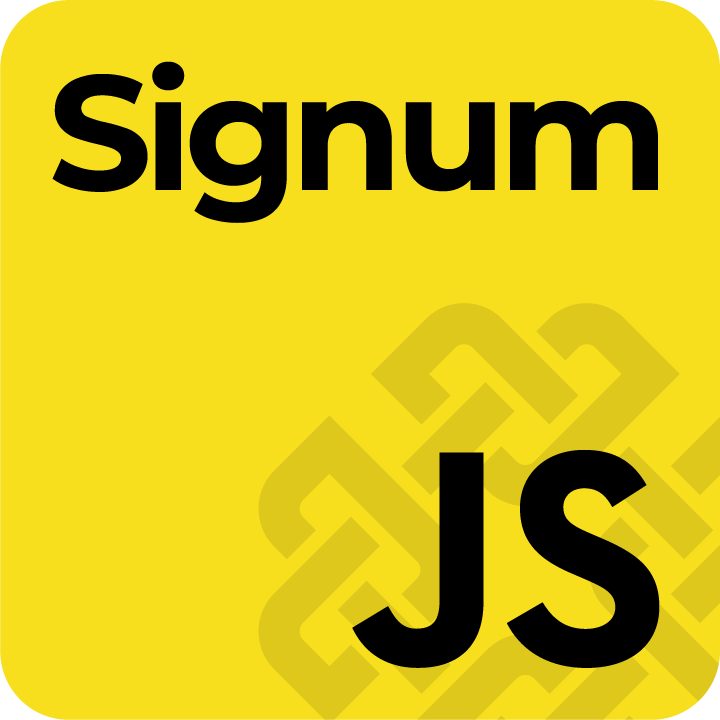

# signumjs-examples

This is a collection of examples for [signumjs](https://github.com/signum-network/signumjs/tree/main)

Please, consider the [Online Documentation](https://github.com/signum-network/phoenix) & (https://github.com/signum-network/signum-xt-wallet) also

> This is a living repo that will be updated from time to time to add more examples

# Installation

> You need git and nodejs (v10+) installed on your machine

First, you need to clone the remote repository to your machine, doing

```
git clone https://github.com/andylamgot/signumjs-examples.git`
```

There are different scenarios of how to use burstjs available. 
Each is organized in different folders

- [cli](./cli/README.MD) - SignumJS for command line interface using NodeJS
- [web](./web/README.MD) - Several Web technologies using SignumJS 
    - vanilla - The most painful way to build a web app (uses minified Signumjs) 
    - svelte - The most hipster way to build e web app (uses npm packages) 
